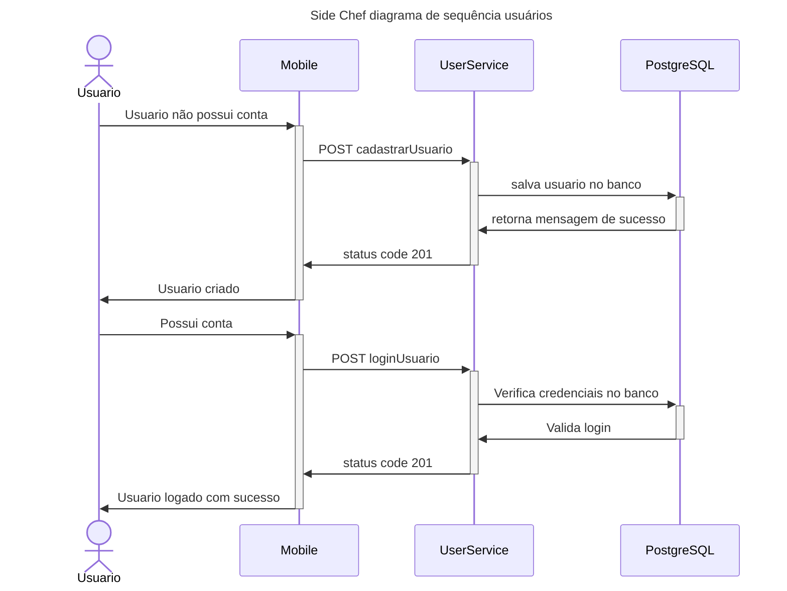
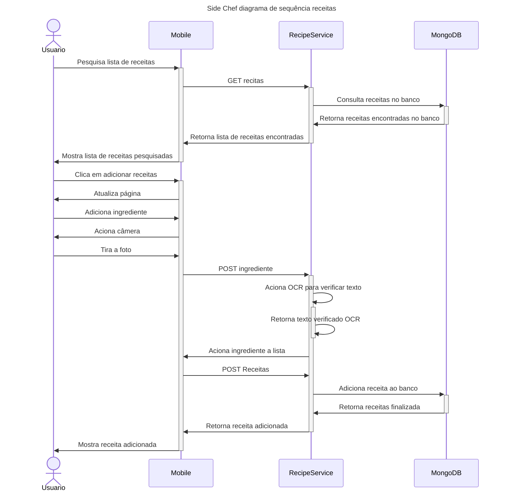
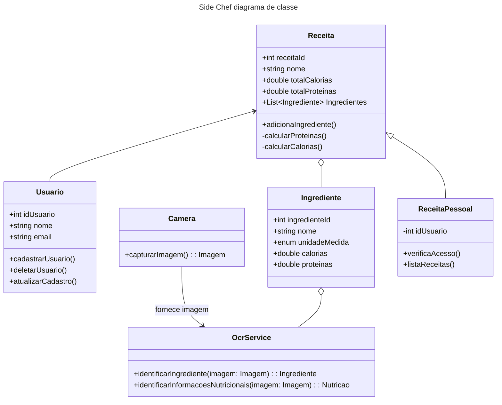
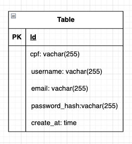
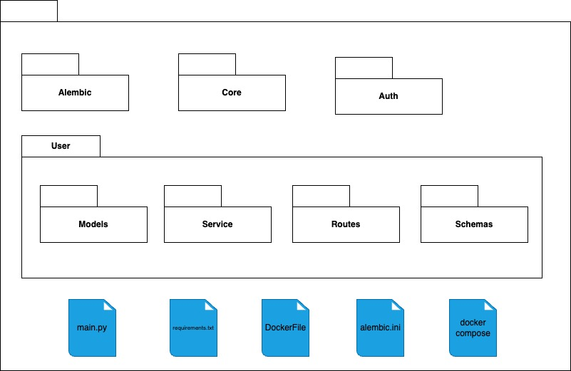
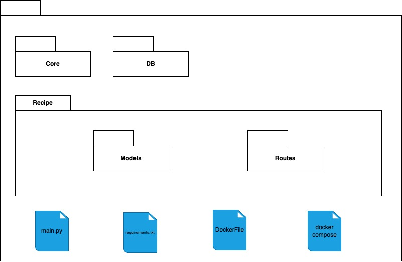

## Histórico de versões

| Versão | Alteração       | Responsável         | Data Alteração |
|--------|-----------------|---------------------|----------------|
| 1.0    | Criação do documento, descrição da visão geral, metas e restrições  e criação de diagrama de tecnologias  | Felipe Candido de Moura | 28/04/2025 |
| 1.1    | Criação da Arquitetura do Banco de Dados | Diógenes Dantas Lélis Júnior | 29/04/2025 |
| 1.2    | Criação diagrama de sequência e classes | Bruno Seiji Kishibe | 29/04/2025 |
| 1.3    | Criação diagrama de pacotes do UserService e RecipeService | Diógenes Dantas Lélis Júnior | 19/05/2025 |

## Visão geral
Este documento visa registrar a aquitetura proposta para o projeto SideChef. 

O software consiste em uma aplicação mobile arquitetada em microsserviços, com o frontend desenvolvido em React Native cuja comunicação de backend é feita utilizando a framework FastAPI. O microsserviço referente aos usuários contará com um banco de dados PostgreSQL, enquanto o referente às receitas com um MongoDB.

## Metas e restrições da arquitetura 
| **Restrição**|**Ferramenta**|
|--------------|--------------|
| Linguagem | Python e TypeScript |
| Framework | React Native e FastAPI |
| Plataforma | Mobile |
| Segurança | Cada usuário contará com uma conta autenticada via token, visto que o aplicativo dará suporte para criação de receitas personalizadas. |
| Idioma | Português|

## Representação da Arquitetura 

### 1. Diagrama de Tecnologias


**Autor:** Felipe Moura

O diagrama de tecnologias demonstra as tecnologias utilizadas no projeto, e como interagem entre si. Pode se ver também a arquitetura de microsserviços explicitada no diagrama e como esta junto a seus componentes se encaixam no sistema.
### Serviços

Podem ser considerados como serviços os diversos subcomponentes do sistema que fornecem algum tipo de interação, ou para com o cliente diretamente, ou para o próprio sistema interno.
#### UserService
O microserviço UserService é responsável pela gerência e armazenamento das contas de usuário do sistema.

#### RecipeService
O microsserviço RecipeService é responável pela gerência e armazenamento das receitas registrado no sistema, tanto as pré-armazenadas pela equipe de desenvolvimento, quanto as criadas pelos próprios usuários.

#### FrontEnd
O frontend consiste na parte visual e utilitária ao qual o usuário interage, no caso será o aplicativo mobile desenvolvido em React Native.

### 2. Diagrama de sequência




**Autor:** Bruno Kishibe

### 3. Diagrama de Classes


**Autor:** Bruno Kishibe

### 4. Arquitetura de banco de dados

### 4.1 Diagrama Entidade Relacionamento

#### 4.1.1 Microsserviço do Usuário (UserService)
<br>
**Autor:** Diógenes Júnior

#### 4.1.2 Microsserviço das Receitas (RecipeService)
```json
{
  "id": "id-da-receita",
  "nome": "nome",
  "ingredientes": ["ingrediente_1", "ingrediente_2"],
  "instrucoes": "Instruções",
  "usuarios_que_salvaram": [
    "id-do-usuario-1",
    "id-do-usuario-2"
  ]
}
```
**Autor:** Diógenes Júnior

### 4.2 Modelo Lógico de Dados

#### 4.2.1 Microsserviço do Usuário (UserService)
<br>
**Autor:** Diógenes Júnior

#### 4.2.2 Microsserviço das Receitas (RecipeService)
```json
{
  "id": "<ObjectId>",               
  "nome": "string",                      
  "ingredientes": ["string"],          
  "instrucoes": "string",               
  "usuarios_que_salvaram": ["string"]    
}
```
**Autor:** Diógenes Júnior

### 5. Diagrama de Pacotes

### 5.1 UserService
<br>
**Autor:** Diógenes Júnior

### 5.2 RecipeService
<br>
**Autor:** Diógenes Júnior

## Referências Bibliográficas
> [1] EQUIPE ARANDU 2024-2. Documento de Arquitetura. Disponível em: https://fga-eps-mds.github.io/2024.2-ARANDU-DOC/projeto/arquitetura/  
> [2] EQUIPE SYSARQ 2021-1. Documento de Arquitetura. Disponível em: https://fga-eps-mds.github.io/2021.1-PC-GO1/doc_arquitetura/ 
> [3] DEVMEDIA. Orientações básicas na elaboração de um diagrama de classes. Disponível em: https://www.devmedia.com.br/orientacoes-basicas-na-elaboracao-de-um-diagrama-de-classes/37224.
> [4] Documentação Oficial MongoDB. Disponível em: https://www.mongodb.com/pt-br/docs/v6.0/core/data-modeling-introduction/


