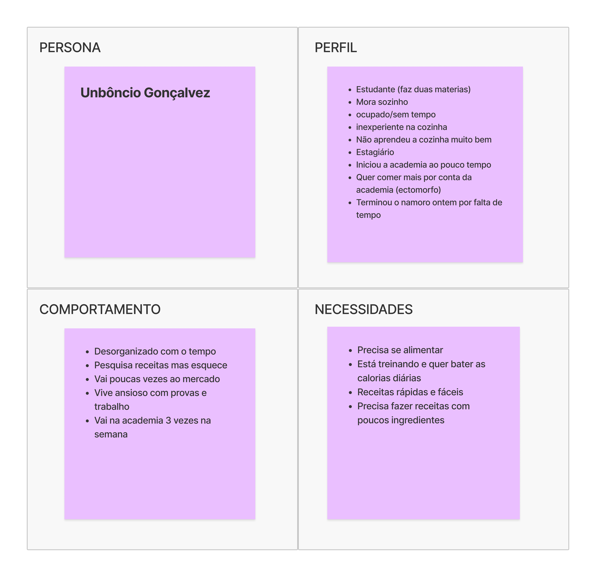
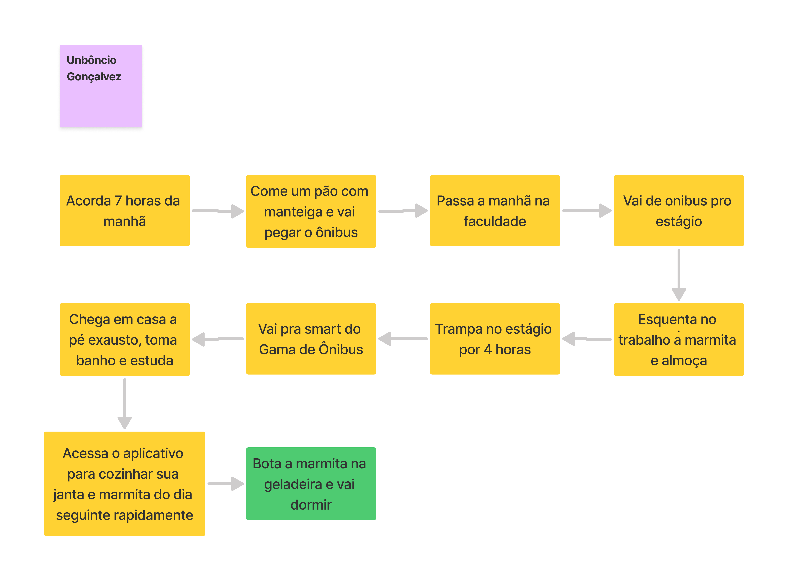
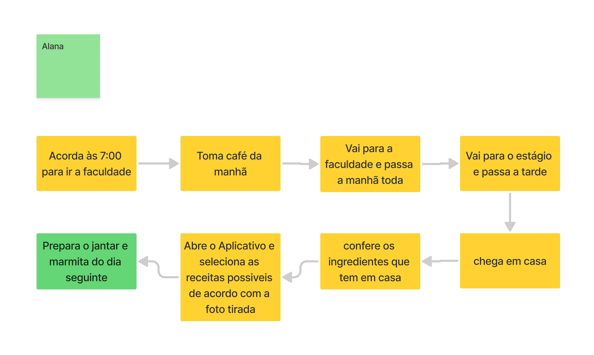
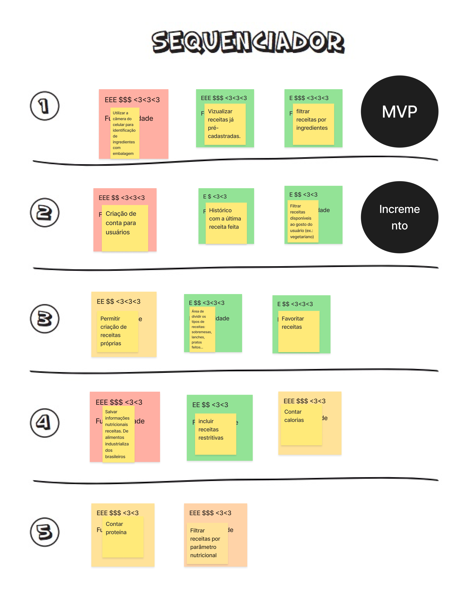

## Objetivo
Este documento visa registrar o que foi desenvolvido no workshop de Lean Inception realizado com toda a equipe para definição do MVP do projeto.

## 1. Primeira reunião - 13/04/2025
### Tabela de participação 
| **Nome**                                  | **Participação** |
|-------------------------------------------|------------------|
| Bruno Seiji Kishibe                           | :white_check_mark: |
| Diógenes Dantas Lélis Júnior                  | :white_check_mark: |
| Felipe Candido de Moura                       | :white_check_mark: |
| Pietro Calegari Visentin                      | :white_check_mark: |
| João Marcelo Guimarães Costa Naves            | :white_check_mark: |
| João Pedro Silveira                           | :white_check_mark: |
| Davi Monteiro de Negreiros                    | :white_check_mark: |
| Leonardo Alves Bezerra                        | :white_check_mark: |
| Vinícius de Jesus Bessa Fernandes             | :white_check_mark: |
| Raissa Silva de Oliveira                      | :white_check_mark: |
| Guilherme Negrerios Pereira                   | :x: |
| Pedro Barretos Cavalcante do Amaral           | :x: |
| Yasmin Dayrell Albuquerque                    | :x: |

### Visão do Produto 
A visão do produto definir a visão do produto de forma colaborativa, definindo o cerne do projeto com uma única frase clara e objetiva.

**Autor:** SideChef Team 2025.1

### É - NÃO É / FAZ - NÃO FAZ
Essa etapa visa definir o que o produto é e não é, e o que ele deve e não fazer, ajudando a equipe a vizualizar melhor o que almejam alcançar.

**Autor:** SideChef Team 2025.1

## 2. Segunda reunião - 16/04/2025

### Tabela de participação 
| **Nome**                                  | **Participação** |
|-------------------------------------------|------------------|
| Bruno Seiji Kishibe                           | :white_check_mark: |
| Davi Monteiro de Negreiros                    | :white_check_mark: |
| Diógenes Dantas Lélis Júnior                  | :white_check_mark: |
| Felipe Candido de Moura                       | :white_check_mark: |
| Guilherme Negrerios Pereira                   | :white_check_mark: |
| João Marcelo Guimarães Costa Naves            | :white_check_mark: |
| João Pedro Silveira                           | :white_check_mark: |
| Leonardo Alves Bezerra                        | :white_check_mark: |
| Pedro Barretos Cavalcante do Amaral           | :white_check_mark: |
| Vinícius de Jesus Bessa Fernandes             | :white_check_mark: |
| Pietro Calegari Visentin                      | :x: |
| Raissa Silva de Oliveira                      | :x: |
| Yasmin Dayrell Albuquerque                    | :x: |

### Objetivos do Produto
A etapa de objetivos do produto propõe que a equipe em colaboração escreva os objetivos de negócio do produto, que depois são separados em cluters de similaridade.

**Autor:** SideChef Team 2025.1

### Personas e Jornada do Usuário
Nesta etapa, a equipe desenvolve personas que viriam a ser exemplos de usuário do produto, pensando em todo o conjunto de características que as compõem.

Após a criação das personas, é definida uma jornada de usuário para cada uma, imaginando como seria a inclusão da utilização do produto na rotida desta.
#### Persona 1 - Unbôncio Gonçalvez

**Autor:** SideChef Team 2025.1

#### Persona 2 - Rogério trader

**Autor:** SideChef Team 2025.1

#### Persona 3 - Alana

**Autor:** SideChef Team 2025.1

### Brainstorm de Funcionalidades
O brainstorm de funcionalidades visa levantar as possíveis funcionalidades para o projeto utilizando a técnica de _brainstorm_, e depois separá-las em clusters de similaridade.

**Autor:** SideChef Team 2025.1

## 3. Terceira reunião - 20/04/2025

### Tabela de participação 
| **Nome**                                  | **Participação** |
|-------------------------------------------|------------------|
| Bruno Seiji Kishibe                           | :white_check_mark: |
| Felipe Candido de Moura                       | :white_check_mark: |
| João Marcelo Guimarães Costa Naves            | :white_check_mark: |
| João Pedro Silveira                           | :white_check_mark: |
| Leonardo Alves Bezerra                        | :white_check_mark: |
| Pedro Barretos Cavalcante do Amaral           | :white_check_mark: |
| Pietro Calegari Visentin                      | :white_check_mark: |
| Raissa Silva de Oliveira                      | :white_check_mark: |
| Vinícius de Jesus Bessa Fernandes             | :white_check_mark: |
| Davi Monteiro de Negreiros                    | :x: |
| Diógenes Dantas Lélis Júnior                  | :x: |
| Guilherme Negrerios Pereira                   | :x: |
| Yasmin Dayrell Albuquerque                    | :x: |

### Revisão Técnica, de Negócio e de UX e Sequenciador
A revisão técnica propõe avaliar cada funcionalidade pensada na etapa do brainstorm, de acordo com a capacidade da equipe em saber o que e como fazer para implementá-la, e pelo seu peso em esforço, custo e impacto para o usuário.

Após isso, etapa do sequenciador organiza as funcionalidades pensadas, de forma incremental, facilitando a visualização da entrega do MVP e seus futuros incrementos.

**Autor:** SideChef Team 2025.1

### Canvas MVP
A etapa final do canvas MVP sumariza tudo o que foi pensado na aplicação do Lean Inception para montagem o que seria o MVP do produto a ser desenvolvido.

**Autor:** SideChef Team 2025.1

## Referências Bibliográficas
> [1] EQUIPE ARANDU 2024-2. Documento de Arquitetura. Disponível em: https://fga-eps-mds.github.io/2024.2-ARANDU-DOC/projeto/arquitetura/  

> [2] EQUIPE SYSARQ 2021-1. Documento de Arquitetura. Disponível em: https://fga-eps-mds.github.io/2021.1-PC-GO1/doc_arquitetura/ 

> [3] CAROLI.org. Lean Inception: Saiba como alinhar pessoas e construir o produto certo. Disponível em: https://caroli.org/lean-inception-3/ 
## Histórico de versões

| Versão | Alteração       | Responsável         | Data Alteração |
|--------|-----------------|---------------------|----------------|
| 1.0    | Criação do documento e escrita do documento  | Felipe Candido de Morua | 28/04/2025 |
