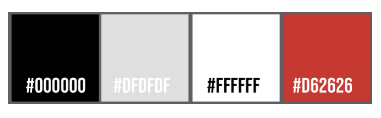
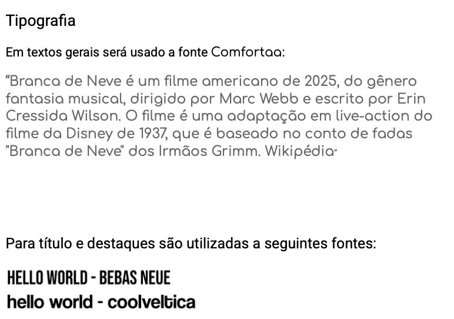

## Histórico de versões

| Versão | Alteração       | Responsável         | Data Alteração |
|--------|-----------------|---------------------|----------------|
| 1.0    | Criação do documento de protótipos e adição do protótipo de baixa fidelidade  | Diógenes Dantas Lélis Júnior | 06/05/2025 | 
| 1.1    | Adição da Identidade Visual e do Protótipo de Alta Fidelidade  | Diógenes Dantas Lélis Júnior | 20/05/2025 | 

## Visão Geral
Protótipos de baixa fidelidade são representações simples e rápidas de um app, geralmente feitos em papel ou com wireframes básicos, focando na estrutura e navegação. Já os de alta fidelidade são mais detalhados, incluindo cores, fontes e interações próximas do produto final. Ambos ajudam a validar ideias e melhorar a experiência do usuário antes do desenvolvimento.

## 1. Protótipo de Baixa Fidelidade

**Autor:** Yasmin Dayrell Albuquerque e João Marcelo Guimarães Costa Naves

### 1.1 Fluxo Básico
- O Usuário Loga na Aplicação
- Na tela principal possui dois fluxos:
    - Ver receitas salvas e pesquisadas anteriormente
    - Acessar a Camera para tirar foto de um ingrediente (Nova Receita)

### 1.2 Fluxo Foto do Ingrediente
- O Usuário tira a foto de um ingrediente
- O Usuário pode tirar foto de outros ingredientes
- Após fotos tiradas, clica-se na opção para pesquisar receitas
- O Aplicativo faz o processamento das imagens e busca as receitas

### 1.3 Fluxo Receitas
- O aplicativo mostra as receitas que são feitas preparadas com os ingredientes selecionados pelo Usuário
- O Usuário acessa a receita desejada
- É mostrado o passo a passo para se realizar a receita (Ingredientes e Modo de Preparo)
- O Usuário pode salvar uma ou mais receitas
- O Usuário volta para tela inicial

## 2. Identidade Visual
O manual de identidade visual tem como objetivo estabelecer orientações claras sobre o uso de cores, tipografia e elementos gráficos a serem aplicados nas soluções desenvolvidas.

### Cores da Marca

Código Hex | Uso Principal                                                                 |
|------------|--------------------------------------------------------------------------------|
| `#000000` | Cor principal para textos                                          |
| `#F6F6F6` | Cor de fundo e textos em destaque sobre fundos escuros             |
| `#D62626` | Cor principal da marca: usada em fundos da tela inicial, barras, caixas e destaques |
| `#DFDFDF` | Cor para detalhes e boxes                                          |

**Autor:** Yasmin Dayrell Albuquerque e João Marcelo Guimarães Costa Naves

### Tipografia

## 3. Protótipo de Alta Fidelidade
<iframe style="border: 1px solid rgba(0, 0, 0, 0.1);" width="800" height="450" src="https://embed.figma.com/design/1alkHmYTmhEOupdVfDwOi7/Untitled?embed-host=share" allowfullscreen></iframe>
**Autor:** Yasmin Dayrell Albuquerque e João Marcelo Guimarães Costa Naves

