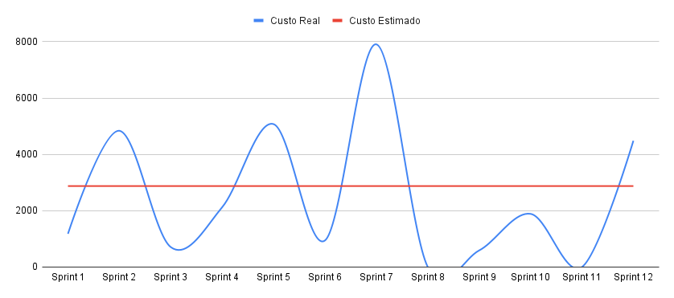

# Planejamento de Custos

| Versão | Alteração       | Responsável         | Data Alteração |
|--------|-----------------|---------------------|----------------|
| 1.0    | Criação do documento de custos | Diógenes Dantas Lélis Júnior | 19/05/2025     |
| 1.1    | Adição valores estimados e planilha | Bruno Seiji Kishibe | 20/05/2025 |
| 1.2    | Adição comparativo entre custo real e estimado | Bruno Seiji Kishibe | 15/07/2025 |

## Introdução
Este documento tem como objetivo detalhar o planejamento de custos do projeto, integrando dados das planilhas dinâmicas com uma abordagem teórica. A proposta é oferecer uma visão clara e estruturada sobre a estimativa, alocação e controle dos recursos financeiros envolvidos.

## Descrição
Para estruturar o cálculo dos custos do projeto, a área de despesas foi segmentada em três categorias principais: equipe de desenvolvimento, equipamentos e infraestrutura. A seguir, detalha-se a metodologia adotada para cada uma dessas divisões.

## Equipe de Desenvolvimento
A estimativa de custos com pessoal foi feita com base no custo-hora de cada integrante da equipe.

## Equipamentos
Na categoria de equipamentos, foram incluídos os custos de aquisição de itens essenciais para o desenvolvimento do projeto, como computadores.

## Infraestutura
Para estimar os custos com infraestrutura, foram considerados energia elétrica e internet, com base nos valores praticados na região de Brasília – DF

## Valores estimados

Infraestrutura - R$ 507,20

Investimento equipamentos - R$ 58.700,00

Equipe de desenvolvimento - R$ 28.768,00

Hospedagem - R$ 0,00

Valor total - R$ 87.975,20

## Custo por Story Point

Usando como base a página de referência [2] para o tempo para uma história de usuário, temos que um desenvolvedor júnior leva em média 8 horas para concluir um story point. Utilizando esse dado como base de cálculo e que foram desenvolvidos ao longo do projeto 154 story points.

$Custo por Story Point = CustoHoraDev * 8$

Custo por Story Point = R$118,00

## Valor Planejado(PV) X Custo Real(AC)

Custo Real do projeto: R$ 89.124,64

| Valor planejado | Custo Real   |
| --------------- | ------------ |
| R$ 87.975,20    | R$ 89.124,64 |

O valor do custo real diferiu pouco do estimado, uma vez que conseguimos manter o valor de hospedagem gratuito, não houveram custos adicionais em relação a hospedagem. Como não foram acompanhadas as horas trabalhadas por membro do grupo, foram utilizadas as Story Points para fazer uma estimativa do valor gasto por dev.

OBS: O valor planejado só foi menor que o custo real por ter sido planejado tendo apenas 10 sprints, por que se fosse utilizado 12 sprints o valor planejado seria de R$ 93.910,24

## Custo time por sprint

Como a única diferênça dos custos foi o valor gasto por membro da equipe, o gráfico a seguir mostra bem a variação entre os valores:

## Documento

<iframe src="https://docs.google.com/spreadsheets/d/1i5JWInrWrBhh6_UjfyeFInkoLYlUCRKaVceh7Z-dXvI/edit?gid=0#gid=0" width="900" height="700"></iframe>

[Link para acessar a planilha](https://docs.google.com/spreadsheets/d/1i5JWInrWrBhh6_UjfyeFInkoLYlUCRKaVceh7Z-dXvI/edit?gid=0#gid=0)

## Referências

[1] Portas abertas ao cidadão. Correio Braziliense, Brasília, 5 mar. 2015. Disponível em: https://www.correiobraziliense.com.br/app/noticia/eu-estudante/ensino_ensinosuperior/2015/03/05/ensino_ensinosuperior_interna,474102/portas-abertas-ao-cidadao.shtml. Acesso em: 20 maio 2025.
[2] COHN, Mike. Don't Equate Story Points to Hours. [S. l.], 6 dez. 2024. Disponível em: https://www.mountaingoatsoftware.com/blog/dont-equate-story-points-to-hours. Acesso em: 15 jul. 2025.