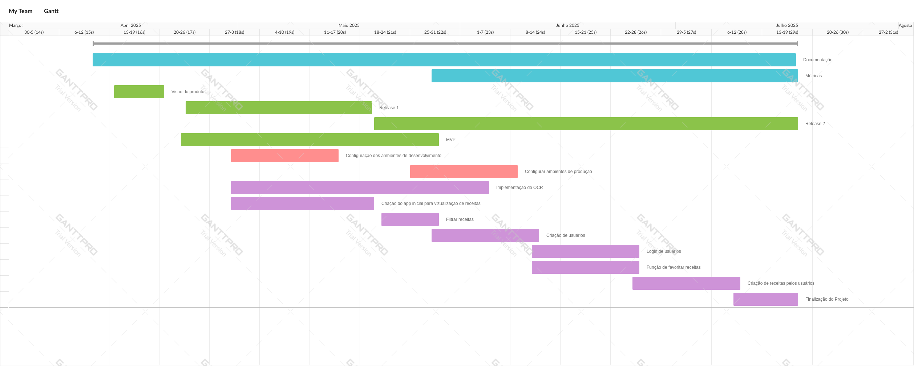

# Planejamento de Tempo

## Descrição

Este artefato visa planejar e estipular o tempo de cada atividade necessária para a entrega do produto de software almejado.

Como forma de representar o planejamento, foi feito um diagrama de Gantt que descreve por meio de barras, a duração de cada atividade ao longo das semanas planejadas para desenvolvimento do projeto.

### Marcos importantes

Os principais marcos de entrega do projeto, de acordo com a descrição do plano de ensino no primeiro semenstre de 2025 são:

__Release 1:__ 19/05/2025

__Release 2 (Final):__ 17/07/2025

## Diagrama de Gantt V1

## Histórico de versões

| Versão | Alteração       | Responsável         | Data Alteração |
|--------|-----------------|---------------------|----------------|
| 1.0    | Criação e escrita do documento, e desenvolvimento da V1 do diagrama | Felipe Candido de Moura| 15/05/2025 |