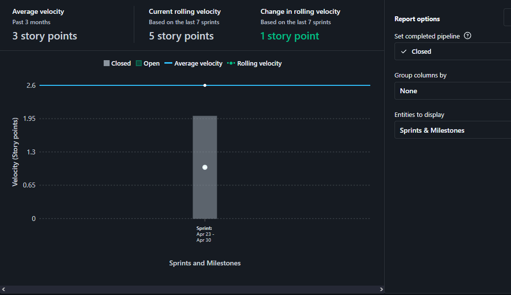
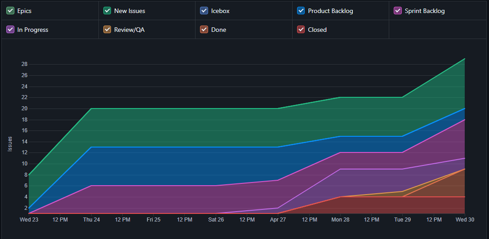

# Ata da Reunião 5

## Histórico de versões

| Versão | Alteração       | Responsável         | Data Alteração |
|--------|-----------------|---------------------|----------------|
| 1.0    | Criação da ata  | Felipe Candido de Moura | 20/05/2025 |

## Reunião 5 - 30/04/2025 21:00

PO - Bruno Seiji Kishibe

Scrum Master - Felipe Candido de Moura

### Atividades realizas

 A sprint 1 foi destinada principalmente para:

 - Ambientação ao trabalho utilizando a metodologia SCRUM;
 
 - Aprendizado das tecnologias propostas;

 - Início do desenvolvimento do protótipo de baixa fidelidade

### Entregas da sprint

- Criação de diagrama de tecnologias. Issue: https://app.zenhub.com/workspaces/2025-1time3ocr-67f593a6ef2d81000f2d84b4/issues/gh/fga-eps-mds/2025.1-sidechef-docs/9

- Documentar lean inception no documentação do projeto. Issue: https://app.zenhub.com/workspaces/2025-1time3ocr-67f593a6ef2d81000f2d84b4/issues/gh/fga-eps-mds/2025.1-sidechef-docs/21

### Pendências da sprint

- Criar protótipo de baixa fidelidade (MDS). Issue: https://app.zenhub.com/workspaces/2025-1time3ocr-67f593a6ef2d81000f2d84b4/issues/gh/fga-eps-mds/2025.1-sidechef-docs/1

- Estudo das tecnologias (MDS). Issue: https://app.zenhub.com/workspaces/2025-1time3ocr-67f593a6ef2d81000f2d84b4/issues/gh/fga-eps-mds/2025.1-sidechef-docs/2

- Modelagem dos bancos de dados (EPS). Issue: https://app.zenhub.com/workspaces/2025-1time3ocr-67f593a6ef2d81000f2d84b4/issues/gh/fga-eps-mds/2025.1-sidechef-docs/4
 
- Criação dos repositórios dos microserviços (EPS). Issue: https://app.zenhub.com/workspaces/2025-1time3ocr-67f593a6ef2d81000f2d84b4/issues/gh/fga-eps-mds/2025.1-sidechef-docs/5

- Criação de documento de arquitetura (EPS). Issue: https://app.zenhub.com/workspaces/2025-1time3ocr-67f593a6ef2d81000f2d84b4/issues/gh/fga-eps-mds/2025.1-sidechef-docs/6

- Criação de diagrama de classes (EPS). Issue: https://app.zenhub.com/workspaces/2025-1time3ocr-67f593a6ef2d81000f2d84b4/issues/gh/fga-eps-mds/2025.1-sidechef-docs/7

- Documentar o planejamento de riscos (EPS). Issue: https://app.zenhub.com/workspaces/2025-1time3ocr-67f593a6ef2d81000f2d84b4/issues/gh/fga-eps-mds/2025.1-sidechef-docs/17

- Documentar o planejamento de custos (EPS). Issue: https://app.zenhub.com/workspaces/2025-1time3ocr-67f593a6ef2d81000f2d84b4/issues/gh/fga-eps-mds/2025.1-sidechef-docs/18

### Dificuldades

- Falta de costume da equipe em trabalhar utilizando Scrum.

- Falta de experiência da equipe nas tecnologias propostas.

### Riscos

Por ser a primeira Sprint, o gráfico de riscos ainda não estava disponível.

### Burndown

Por ser a primeira Sprint, o gráfico de burndown ainda não estava disponível.

### Velocity

**Grafico Velocity Sprint 1**

### Comulative Flow

**Grafico Cumulative Flow Sprint 1**

### Control Charts

Por ser a primeira Sprint, o gráfico de control charts ainda não estava disponível.

## Participantes

| Nome completo                                 | Matrícula   | Turma |
|-----------------------------------------------|-------------|-------|
| Bruno Seiji Kishibe                           | 200072854   | EPS   |
| Diógenes Dantas Lélis Júnior                  | 190105267   | EPS   |
| Felipe Candido de Moura                       | 200030469   | EPS   |
| João Marcelo Guimarães Costa Naves            | 232014709   | MDS   |
| João Pedro Silveira                           | 232014718   | MDS   |
| Davi Monteiro de Negreiros                    | 232013971   | MDS   | 
| Leonardo Alves Bezerra                        | 231011604   | MDS   | 
| Vinícius de Jesus Bessa Fernandes             | 222006490   | MDS   | 
| Pietro Calegari Visentin                      | 232014754   | MDS   | 
| Yasmin Dayrell Albuquerque                    | 232014226   | MDS   |

## Não participaram

| Nome completo                                 | Justificativa                                        | Turma |
|-----------------------------------------------|------------------------------------------------------|-------|
| Felipe Candido de Moura                       | Estava em um aniversário  | EPS   |
| Guilherme Negreiros Pereira                   | Estava preso no trânsito  | MDS   |
| Pedro Barretos Cavalcante do Amaral           | Estava viajando durante a reunião   | MDS   |
| Raissa Silva de Oliveira                      | Estava viajando durante a reunião   | MDS   |

