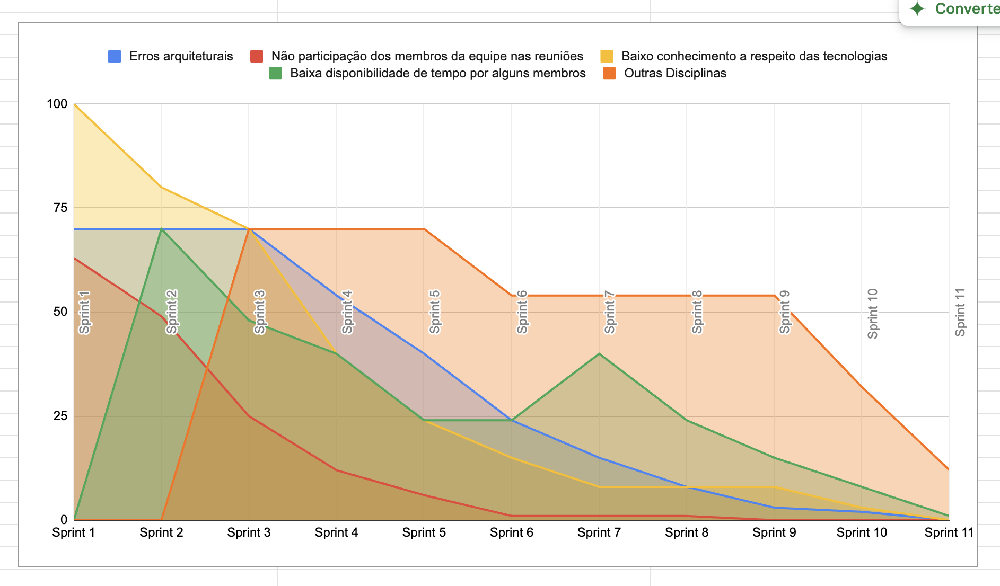

# Ata da Reunião 25

## Histórico de versões

| Versão | Alteração       | Responsável         | Data Alteração |
|--------|-----------------|---------------------|----------------|
| 1.0    | Criação da ata  | Diógenes Dantas Lélis Júnior | 12/07/2025  |

## Reunião 25 - 09/07/2025 20:00

PO - Diógenes Dantas Lélis Júnior

Scrum Master - Bruno Seiji Kishibe

### Atividades realizas

Review da Sprint 10, realizando as seguintes atividades:

- Alinhamento entre a equipe sobre o que foi e não foi feito.

### Entregas da sprint

- Não houve entregas na Sprint 11, pois os membros ainda estavam trabalhando nas issues que ficaram como pendência da Sprint 10 e na finalização da User Stories que haviam sido definidas no início do projeto.

### Pendências da sprint

- [US01 - INCREMENTO] Adição de imagens para visualização das receitas (Débito Sprint 09). Issue: [[US01 - INCREMENTO] Adição de imagens para visualização das receitas](https://app.zenhub.com/workspaces/2025-1time3ocr-67f593a6ef2d81000f2d84b4/issues/gh/fga-eps-mds/2025.1-sidechef-docs/78)

- US07 - Prototipação Tela de Criação de Receitas (Débito Sprint 10). Issue: [US07 - Prototipação Tela de Criação de Receitas](https://app.zenhub.com/workspaces/2025-1time3ocr-67f593a6ef2d81000f2d84b4/issues/gh/fga-eps-mds/2025.1-sidechef-docs/84)

- US07 - Criação de tela para criação de receitas (Débito Sprint 10). Issue: [US07 - Criação de tela para criação de receitas](https://app.zenhub.com/workspaces/2025-1time3ocr-67f593a6ef2d81000f2d84b4/issues/gh/fga-eps-mds/2025.1-sidechef-docs/90)

- Teste de Aceitação de Usuário (Débito Sprint 10). Issue: [Teste de Aceitação de Usuário](https://app.zenhub.com/workspaces/2025-1time3ocr-67f593a6ef2d81000f2d84b4/issues/gh/fga-eps-mds/2025.1-sidechef-docs/85)

- US01 - Refazer tela inicial no novo design (Débito Sprint 10). Issue: [US01 - Refazer tela inicial no novo design](https://app.zenhub.com/workspaces/2025-1time3ocr-67f593a6ef2d81000f2d84b4/issues/gh/fga-eps-mds/2025.1-sidechef-docs/89)

- US01 - Refazer tela de detalhamento de receitas no novo design (Débito Sprint 10). Issue: [US01 - Refazer tela de detalhamento de receitas no novo design](https://app.zenhub.com/workspaces/2025-1time3ocr-67f593a6ef2d81000f2d84b4/issues/gh/fga-eps-mds/2025.1-sidechef-docs/89)

- US03/US04 - Nova prototipagem e implementação de telas referentes à conta de usuários e ao OCR (Débito Sprint 10). Issue: [US03/US04 - Nova prototipagem e implementação de telas referentes à conta de usuários e ao OCR](https://app.zenhub.com/workspaces/2025-1time3ocr-67f593a6ef2d81000f2d84b4/issues/gh/fga-eps-mds/2025.1-sidechef-docs/91)

- US07 - Ajuste dos backends para criação de receitas (Débito Sprint 10). Issue: [US07 - Ajuste dos backends para criação de receitas](https://app.zenhub.com/workspaces/2025-1time3ocr-67f593a6ef2d81000f2d84b4/issues/gh/fga-eps-mds/2025.1-sidechef-docs/92)

### Dificuldades

- Cansaço devido ao horário de início e a duração da reunião.

### Riscos

**Grafico De riscos Sprint 11**

### Burndown

**Grafico BurnDown Sprint 11**

### Velocity

**Grafico Velocity Sprint 11**

### Comulative Flow

**Grafico Cumulative Flow Sprint 11**

### Control Charts

**Grafico ControlCharts Sprint 11**

## Participantes

| Nome completo                                 | Matrícula   | Turma |
|-----------------------------------------------|-------------|-------|
| Bruno Seiji Kishibe                           | 200072854   | EPS   |
| Diógenes Dantas Lélis Júnior                  | 190105267   | EPS   |
| Felipe Candido de Moura                       | 200030469   | EPS   |
| João Marcelo Guimarães Costa Naves            | 232014709   | MDS   |
| João Pedro Silveira                           | 232014718   | MDS   |
| Davi Monteiro de Negreiros                    | 232013971   | MDS   |
| Leonardo Alves Bezerra                        | 231011604   | MDS   | 
| Vinícius de Jesus Bessa Fernandes             | 222006490   | MDS   | 
| Guilherme Negreiros Pereira                   | 232014001   | MDS   |
| Pedro Barretos Cavalcante do Amaral           | 232038433   | MDS   |
| Pietro Calegari Visentin                      | 232014754   | MDS   |
| Yasmin Dayrell Albuquerque                    | 232014226   | MDS   |
| Raissa Silva de Oliveira                      | 232014763   | MDS   |

## Não participaram

| Nome completo                                 | Justificativa                                        | Turma |
|-----------------------------------------------|------------------------------------------------------|-------|

