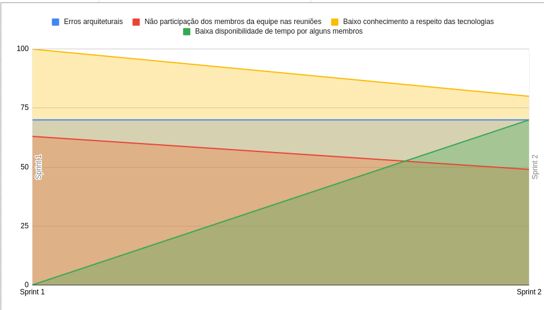
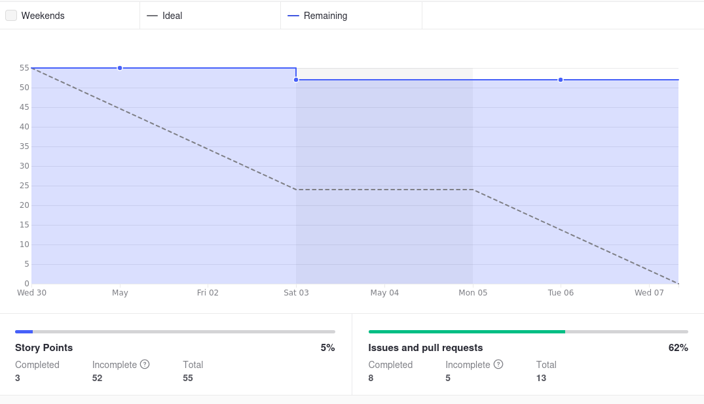
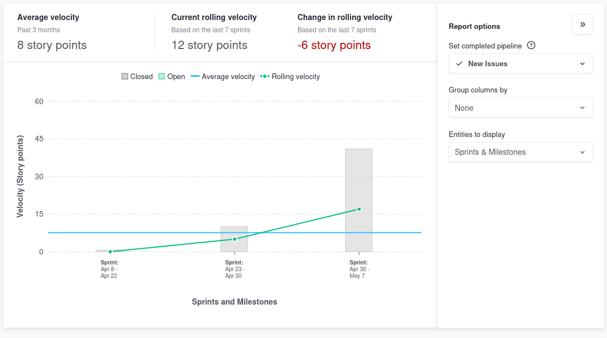
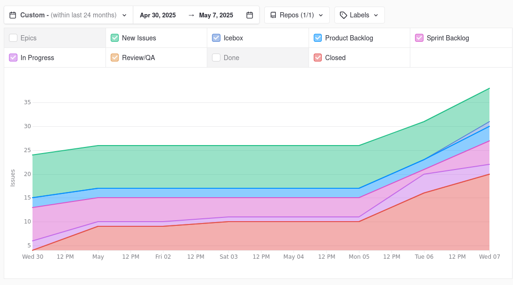
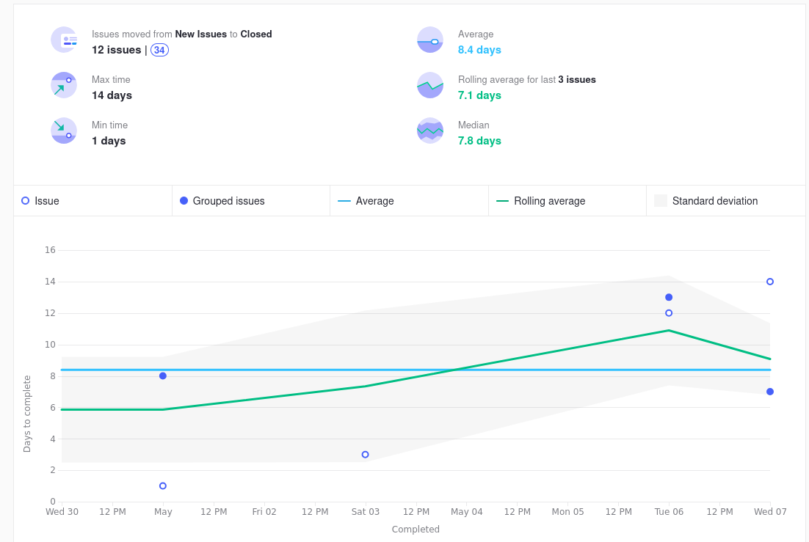

# Ata da Reunião 7

## Reunião 7 - 07/05/2025 20:00

### Atividades realizas

Review da Sprint 2, realizando as seguintes atividades:

- Mostrar o que atividades realizadas.

- Alinhamento entre a equipe sobre o que foi e não foi feito.

- Discução sobre o que foi feito.

- Discução de como seguiremos com a solução do OCR

- Levantamento de melhoras e do processo do time.

### Entregas da sprint

- Protótipo de baixa fidelidade.

- Repositório com teste básico da funcionalidade do OCR.

- CSV com receitas para popular o banco.

- Tela com logo.

- Tela inicial mobile.

### Pendências da sprint

- Protótipo de alta fidelidade finalizado.

### Dificuldades

- Cansaço devido ao horário de início e a duração da reunião

- Pouco tempo para realização das atividades por alguns membros do grupo

### Riscos

**Grafico De riscos Sprint 2**

### Burndown

**Grafico BurnDown Sprint 2**

### Velocity

**Grafico Velocity Sprint2**

### Comulative Flow

**Grafico Cumulative Flow Sprint 2**

### Control Charts

**Grafico ControlCharts Sprint 2**

## Participantes

| Nome completo                                 | Matrícula   | Turma |
|-----------------------------------------------|-------------|-------|
| Bruno Seiji Kishibe                           | 200072854   | EPS   |
| Diógenes Dantas Lélis Júnior                  | 190105267   | EPS   |
| Felipe Candido de Moura                       | 200030469   | EPS   |
| João Marcelo Guimarães Costa Naves            | 232014709   | MDS   |
| Davi Monteiro de Negreiros                    | 232013971   | MDS   |
| Leonardo Alves Bezerra                        | 231011604   | MDS   | 
| Vinícius de Jesus Bessa Fernandes             | 222006490   | MDS   | 
| Guilherme Negreiros Pereira                   | 232014001   | MDS   |
| Pedro Barretos Cavalcante do Amaral           | 232038433   | MDS   |
| Pietro Calegari Visentin                      | 232014754   | MDS   |
| Yasmin Dayrell Albuquerque                    | 232014226   | MDS   |
| Raissa Silva de Oliveira                      | 232014763   | MDS   |

## Não participaram

| Nome completo                                 | Justificativa                                        | Turma |
|-----------------------------------------------|------------------------------------------------------|-------|
| João Pedro Silveira                           |                                                      | MDS   |

## Histórico de versões

| Versão | Alteração       | Responsável         | Data Alteração |
|--------|-----------------|---------------------|----------------|
| 1.0    | Criação da ata  | Bruno Seiji Kishibe | 07/05/2025     |
| 1.1    | Adição graficos | Bruno Seiji Kishibe | 15/05/2025     |
