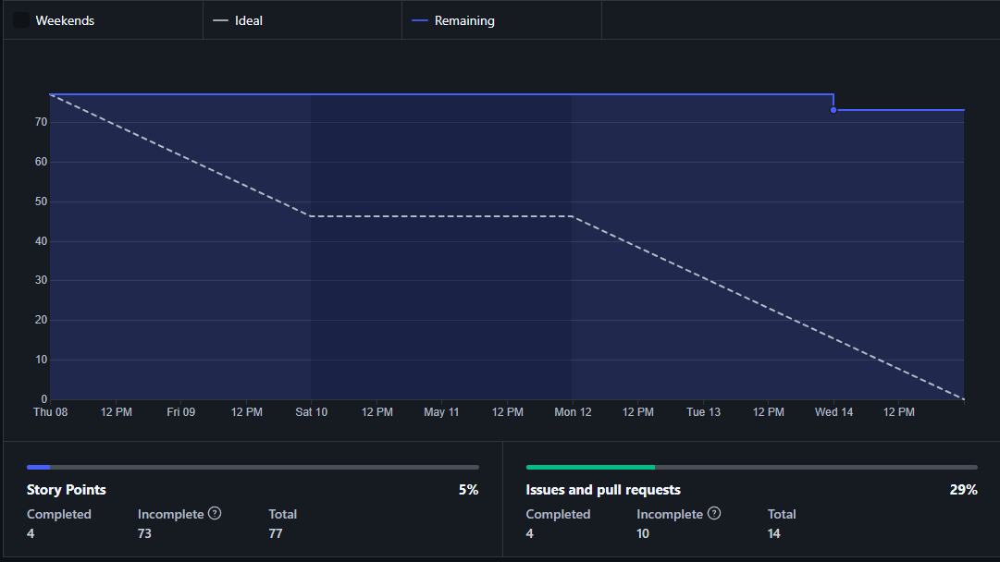
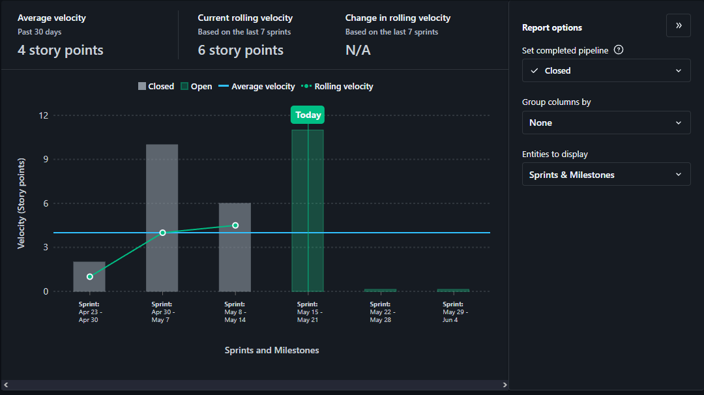
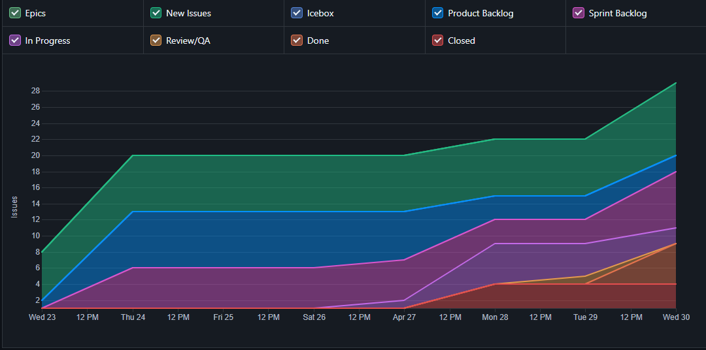
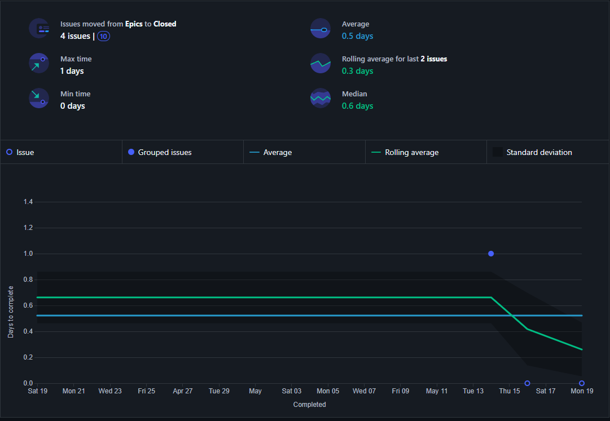

# Ata da Reunião 9

## Reunião 9 - 14/05/2025 20:00

PO - Felipe Candido de Moura

Scrum Master - Diógenes Dantas Lélis Júnior

### Atividades realizas

Review da Sprint 3, realizando as seguintes atividades:

- Mostrar o que atividades realizadas.

- Alinhamento entre a equipe sobre o que foi e não foi feito.

- Discução sobre o que foi feito.

- Alinhamento a respeito de entrega de código realizada pelos membros de MDS

### Entregas da sprint

- Criar template Pull Request. Issue: https://app.zenhub.com/workspaces/2025-1time3ocr-67f593a6ef2d81000f2d84b4/issues/gh/fga-eps-mds/2025.1-sidechef-docs/35

- Configurar docker do repositório UserService. Issue: https://app.zenhub.com/workspaces/2025-1time3ocr-67f593a6ef2d81000f2d84b4/issues/gh/fga-eps-mds/2025.1-sidechef-docs/40

- Configurar docker do repositório RecipeService. Issue: https://app.zenhub.com/workspaces/2025-1time3ocr-67f593a6ef2d81000f2d84b4/issues/gh/fga-eps-mds/2025.1-sidechef-docs/41

- Adicionar câmera ao aplicativo. Issue: https://app.zenhub.com/workspaces/2025-1time3ocr-67f593a6ef2d81000f2d84b4/issues/gh/fga-eps-mds/2025.1-sidechef-docs/33

- Implantação do OCR em FastAPI. Issue: https://app.zenhub.com/workspaces/2025-1time3ocr-67f593a6ef2d81000f2d84b4/issues/gh/fga-eps-mds/2025.1-sidechef-docs/36

- Endpoint de cadastro de usuário. Issue: https://app.zenhub.com/workspaces/2025-1time3ocr-67f593a6ef2d81000f2d84b4/issues/gh/fga-eps-mds/2025.1-sidechef-docs/37

### Pendências da sprint

- US01 - Vizualizar Receitas. Issue: https://app.zenhub.com/workspaces/2025-1time3ocr-67f593a6ef2d81000f2d84b4/issues/gh/fga-eps-mds/2025.1-sidechef-docs/10

- US02 - Criação de filtros para receitas. Issue: https://app.zenhub.com/workspaces/2025-1time3ocr-67f593a6ef2d81000f2d84b4/issues/gh/fga-eps-mds/2025.1-sidechef-docs/11

- US04 - Identificação de ingredientes por meio de OCR. Issue: https://app.zenhub.com/workspaces/2025-1time3ocr-67f593a6ef2d81000f2d84b4/issues/gh/fga-eps-mds/2025.1-sidechef-docs/13

- Documentar o planejamento de custos. Issue: https://app.zenhub.com/workspaces/2025-1time3ocr-67f593a6ef2d81000f2d84b4/issues/gh/fga-eps-mds/2025.1-sidechef-docs/18

- Criar protótipo de alta fidelidade. Issue: https://app.zenhub.com/workspaces/2025-1time3ocr-67f593a6ef2d81000f2d84b4/issues/gh/fga-eps-mds/2025.1-sidechef-docs/20

- Configurar CI repositório mobile. Issue: https://app.zenhub.com/workspaces/2025-1time3ocr-67f593a6ef2d81000f2d84b4/issues/gh/fga-eps-mds/2025.1-sidechef-docs/28

- Endpoint para receber todas as receitas do MongoDB. Issue: https://app.zenhub.com/workspaces/2025-1time3ocr-67f593a6ef2d81000f2d84b4/issues/gh/fga-eps-mds/2025.1-sidechef-docs/38

### Dificuldades
- Cansaço devido ao horário de início e a duração da reunião

### Riscos

**Grafico De riscos Sprint 3**

### Burndown

**Grafico BurnDown Sprint 3**

### Velocity

**Grafico Velocity Sprint3**

### Comulative Flow

**Grafico Cumulative Flow Sprint 3**

### Control Charts

**Grafico ControlCharts Sprint 3**

## Participantes

| Nome completo                                 | Matrícula   | Turma |
|-----------------------------------------------|-------------|-------|
| Bruno Seiji Kishibe                           | 200072854   | EPS   |
| Diógenes Dantas Lélis Júnior                  | 190105267   | EPS   |
| Felipe Candido de Moura                       | 200030469   | EPS   |
| João Marcelo Guimarães Costa Naves            | 232014709   | MDS   |
| João Pedro Silveira                           | 232014718   | MDS   |
| Davi Monteiro de Negreiros                    | 232013971   | MDS   |
| Leonardo Alves Bezerra                        | 231011604   | MDS   | 
| Vinícius de Jesus Bessa Fernandes             | 222006490   | MDS   | 
| Guilherme Negreiros Pereira                   | 232014001   | MDS   |
| Pedro Barretos Cavalcante do Amaral           | 232038433   | MDS   |
| Pietro Calegari Visentin                      | 232014754   | MDS   |
| Yasmin Dayrell Albuquerque                    | 232014226   | MDS   |
| Raissa Silva de Oliveira                      | 232014763   | MDS   |

## Não participaram

| Nome completo                                 | Justificativa                                        | Turma |
|-----------------------------------------------|------------------------------------------------------|-------|
| Felipe Candido de Moura                    | Estava em aniversário                                                  | EPS  |

## Histórico de versões

| Versão | Alteração       | Responsável         | Data Alteração |
|--------|-----------------|---------------------|----------------|
| 1.0    | Criação da ata  | Diógenes Dantas Lélis Júnior | 20/05/2025     |

