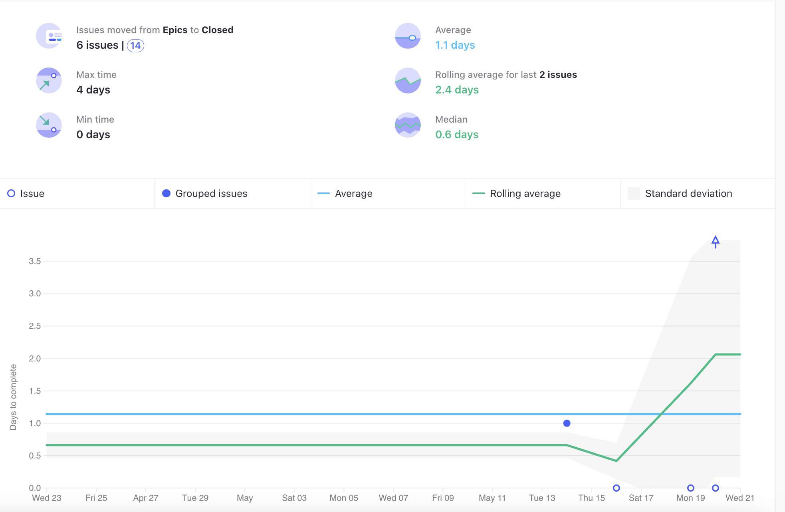

# Ata da Reunião 11

## Histórico de versões

| Versão | Alteração       | Responsável         | Data Alteração |
|--------|-----------------|---------------------|----------------|
| 1.0    | Criação da ata  | Bruno Seiji Kishibe | 27/06/2025     |
| 1.1    | Edição de ata, adicionando as pendências e os gráficos da Sprint 4  | Diógenes Dantas Lélis Júnior | 10/07/2025  |
| 1.2    | Adiciona gráfico de Riscos  | Diógenes Dantas Lélis Júnior | 10/07/2025  |
| 1.3    | Edita PO e Scrum Master da Ata  | Diógenes Dantas Lélis Júnior | 10/07/2025  |

## Reunião 11 - 21/05/2025 20:00

PO - Felipe Candido de Moura

Scrum Master - Bruno Seiji Kishibe

### Atividades realizas

Review da Sprint 4, realizando as seguintes atividades:

- Mostrar o que atividades realizadas.

- Alinhamento entre a equipe sobre o que foi e não foi feito.

- Discução sobre o que foi feito.

- Levantamento de melhoras e do processo do time.

### Entregas da sprint

- Protótipo de baixa fidelidade (MDS). Issue: [Criar protótipo de baixa fidelidade](https://app.zenhub.com/workspaces/2025-1time3ocr-67f593a6ef2d81000f2d84b4/issues/gh/fga-eps-mds/2025.1-sidechef-docs/1)

- Documentar o planejamento de tempo. Issue: [Documentar o planejamento de tempo](https://app.zenhub.com/workspaces/2025-1time3ocr-67f593a6ef2d81000f2d84b4/issues/gh/fga-eps-mds/2025.1-sidechef-docs/19)

- Bug no DockerFile e no Docker-Compose do UserService. Issue: [Bug no DockerFile e no Docker-Compose do UserService](https://app.zenhub.com/workspaces/2025-1time3ocr-67f593a6ef2d81000f2d84b4/issues/gh/fga-eps-mds/2025.1-sidechef-docs/53)

- Bug na conexão do fastapi com o MongoDB. Issue: [Bug na conexão do fastapi com o MongoDB](https://app.zenhub.com/workspaces/2025-1time3ocr-67f593a6ef2d81000f2d84b4/issues/gh/fga-eps-mds/2025.1-sidechef-docs/55)

- Atas Sprint3. Issue: [Atas sprint3](https://app.zenhub.com/workspaces/2025-1time3ocr-67f593a6ef2d81000f2d84b4/issues/gh/fga-eps-mds/2025.1-sidechef-docs/54)

- Actions de Build no UserService. Issue: [Actions de Build no UserService](https://app.zenhub.com/workspaces/2025-1time3ocr-67f593a6ef2d81000f2d84b4/issues/gh/fga-eps-mds/2025.1-sidechef-docs/57)

- Documentar Review da Sprint 3. Issue: [Documentar Review da Sprint 3](https://app.zenhub.com/workspaces/2025-1time3ocr-67f593a6ef2d81000f2d84b4/issues/gh/fga-eps-mds/2025.1-sidechef-docs/60)

### Pendências da sprint

- Adicionar receitas na tela inicial. Issue: [Adicionar receitas na tela inicial](https://app.zenhub.com/workspaces/2025-1time3ocr-67f593a6ef2d81000f2d84b4/issues/gh/fga-eps-mds/2025.1-sidechef-docs/42)

- Endpoint filtro receitas. Issue: [Endpoint filtro receitas](https://app.zenhub.com/workspaces/2025-1time3ocr-67f593a6ef2d81000f2d84b4/issues/gh/fga-eps-mds/2025.1-sidechef-docs/43)

- Integrar OCR com receipeService. Issue: [Integrar OCR com receipeService](https://app.zenhub.com/workspaces/2025-1time3ocr-67f593a6ef2d81000f2d84b4/issues/gh/fga-eps-mds/2025.1-sidechef-docs/44)

- Integrar endpoints usuario ao banco. Issue: [Integrar endpoints usuario ao banco](https://app.zenhub.com/workspaces/2025-1time3ocr-67f593a6ef2d81000f2d84b4/issues/gh/fga-eps-mds/2025.1-sidechef-docs/45)

- Tela individual das receitas. Issue: [Tela individual das receitas](https://app.zenhub.com/workspaces/2025-1time3ocr-67f593a6ef2d81000f2d84b4/issues/gh/fga-eps-mds/2025.1-sidechef-docs/46)

- Configuração do MongoDB do Microsserviço RecipeService. Issue: [Configuração do MongoDB do microsserviço RecipeService](https://app.zenhub.com/workspaces/2025-1time3ocr-67f593a6ef2d81000f2d84b4/issues/gh/fga-eps-mds/2025.1-sidechef-docs/52)

- Adicionar Build Testes UserService e RecipeService. Issue: [Adicionar Build Testes UserService e RecipeService](https://app.zenhub.com/workspaces/2025-1time3ocr-67f593a6ef2d81000f2d84b4/issues/gh/fga-eps-mds/2025.1-sidechef-docs/59)

- Configurar Docker Mobile. Issue: [Configurar Docker Mobile](https://app.zenhub.com/workspaces/2025-1time3ocr-67f593a6ef2d81000f2d84b4/issues/gh/fga-eps-mds/2025.1-sidechef-docs/63)

- Documentar Protótipo de Alta Fidelidade e Identidade Visual. Issue: [Documentar Protótipo de Alta Fidelidade e Identidade Visual](https://app.zenhub.com/workspaces/2025-1time3ocr-67f593a6ef2d81000f2d84b4/issues/gh/fga-eps-mds/2025.1-sidechef-docs/66)

- Padronização de código dos três repositórios. Issue: [Padronização de código dos três repositórios](https://app.zenhub.com/workspaces/2025-1time3ocr-67f593a6ef2d81000f2d84b4/issues/gh/fga-eps-mds/2025.1-sidechef-docs/69)

- Implementação de componentes de filtro FrontEnd. Issue: [Implementação de componentes de filtro FrontEnd](https://app.zenhub.com/workspaces/2025-1time3ocr-67f593a6ef2d81000f2d84b4/issues/gh/fga-eps-mds/2025.1-sidechef-docs/71)

- Implementação da interpretação do resultado do OCR. Issue: [Implementação da interpretação do resultado do OCR](https://app.zenhub.com/workspaces/2025-1time3ocr-67f593a6ef2d81000f2d84b4/issues/gh/fga-eps-mds/2025.1-sidechef-docs/70)

### Dificuldades

- Cansaço devido ao horário de início e a duração da reunião.

- Pouco tempo para realização das atividades por alguns membros do grupo.

### Riscos

**Grafico De riscos Sprint 4**

### Burndown

**Grafico BurnDown Sprint 4**

### Velocity

**Grafico Velocity Sprint4**

### Comulative Flow

**Grafico Cumulative Flow Sprint 4**

### Control Charts

**Grafico ControlCharts Sprint 4**

## Participantes

| Nome completo                                 | Matrícula   | Turma |
|-----------------------------------------------|-------------|-------|
| Bruno Seiji Kishibe                           | 200072854   | EPS   |
| Diógenes Dantas Lélis Júnior                  | 190105267   | EPS   |
| Felipe Candido de Moura                       | 200030469   | EPS   |
| João Marcelo Guimarães Costa Naves            | 232014709   | MDS   |
| Davi Monteiro de Negreiros                    | 232013971   | MDS   |
| Leonardo Alves Bezerra                        | 231011604   | MDS   | 
| Vinícius de Jesus Bessa Fernandes             | 222006490   | MDS   | 
| Guilherme Negreiros Pereira                   | 232014001   | MDS   |
| Pedro Barretos Cavalcante do Amaral           | 232038433   | MDS   |
| Pietro Calegari Visentin                      | 232014754   | MDS   |
| Yasmin Dayrell Albuquerque                    | 232014226   | MDS   |
| Raissa Silva de Oliveira                      | 232014763   | MDS   |

## Não participaram

| Nome completo                                 | Justificativa                                        | Turma |
|-----------------------------------------------|------------------------------------------------------|-------|
| João Pedro Silveira                           | Sem justificativa                                       | MDS   |

