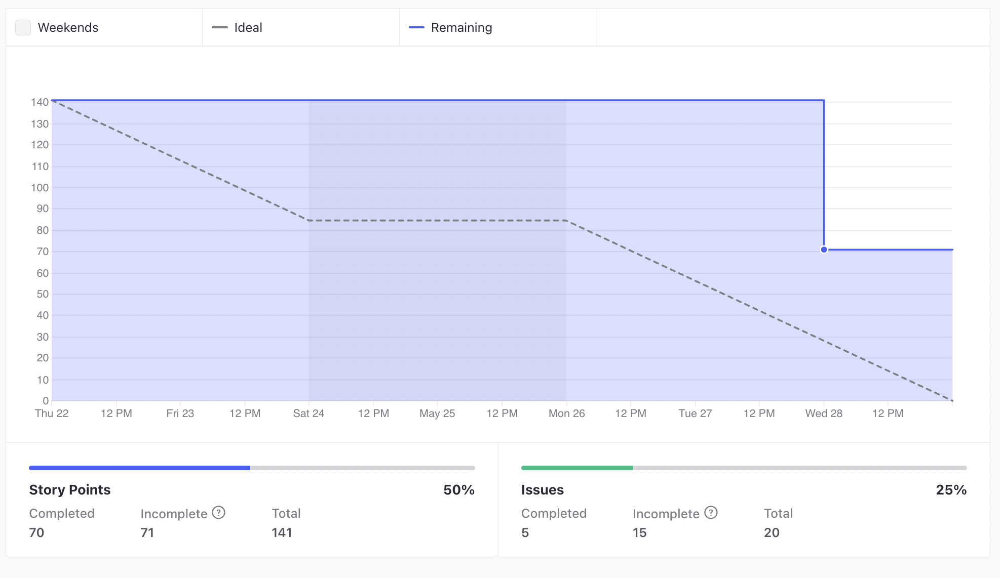
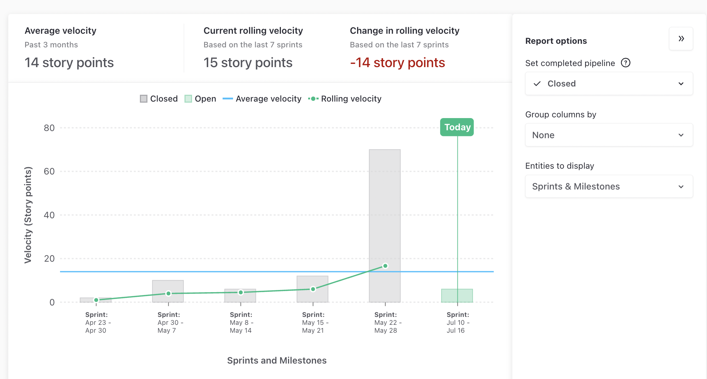
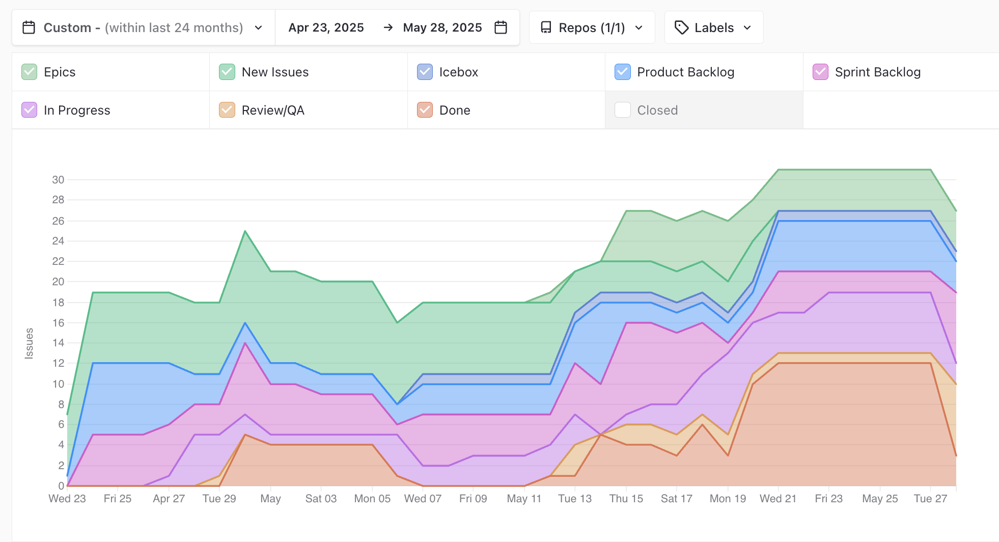
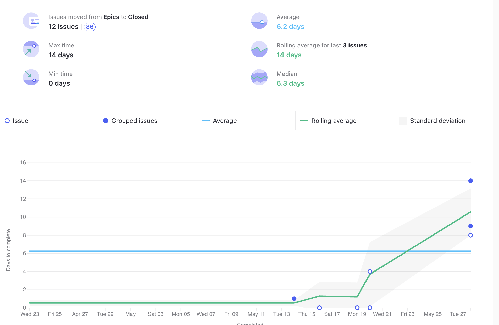

# Ata da Reunião 13

## Histórico de versões

| Versão | Alteração       | Responsável         | Data Alteração |
|--------|-----------------|---------------------|----------------|
| 1.0    | Criação da ata  | Felipe Candido Moura | 27/06/2025    |

## Reunião 13 - 28/05/2025 21:00

PO - Felipe Candido de Moura

Scrum Master - Bruno Seiji Kishibe

### Atividades realizas

Review da Sprint 5, realizando as seguintes atividades:

- Mostrar o que atividades realizadas.

- Alinhamento entre a equipe sobre o que foi e não foi feito.

- Discução sobre o que foi feito.

- Levantamento de melhoras e do processo do time.

### Entregas da sprint

- Endpoint filtro receitas (Débito Sprint 4). Issue: [Endpoint filtro receitas](https://app.zenhub.com/workspaces/2025-1time3ocr-67f593a6ef2d81000f2d84b4/issues/gh/fga-eps-mds/2025.1-sidechef-docs/43)

- Integrar OCR com receipeService (Débido Sprint 4). Issue: [Integrar OCR com receipeService](https://app.zenhub.com/workspaces/2025-1time3ocr-67f593a6ef2d81000f2d84b4/issues/gh/fga-eps-mds/2025.1-sidechef-docs/44)

- Integrar endpoints usuario ao banco (Débito Sprint 4). Issue: [Integrar endpoints usuario ao banco](https://app.zenhub.com/workspaces/2025-1time3ocr-67f593a6ef2d81000f2d84b4/issues/gh/fga-eps-mds/2025.1-sidechef-docs/45)

- Adicionar Build Testes UserService e RecipeService (Débito Sprint 4). Issue: [Adicionar Build Testes UserService e RecipeService](https://app.zenhub.com/workspaces/2025-1time3ocr-67f593a6ef2d81000f2d84b4/issues/gh/fga-eps-mds/2025.1-sidechef-docs/59)

- Documentar Protótipo de Alta Fidelidade e Identidade Visual (Débito Sprint 4). Issue: [Documentar Protótipo de Alta Fidelidade e Identidade Visual](https://app.zenhub.com/workspaces/2025-1time3ocr-67f593a6ef2d81000f2d84b4/issues/gh/fga-eps-mds/2025.1-sidechef-docs/66)

### Pendências da sprint

- Criar Testes no Mobile. Issue: [Criar Testes no Mobile](https://app.zenhub.com/workspaces/2025-1time3ocr-67f593a6ef2d81000f2d84b4/issues/gh/fga-eps-mds/2025.1-sidechef-docs/73)

### Dificuldades

- Cansaço devido ao horário de início e a duração da reunião.

### Riscos

**Grafico De riscos Sprint 5**

### Burndown

**Grafico BurnDown Sprint 5**

### Velocity

**Grafico Velocity Sprint 5**

### Comulative Flow

**Grafico Cumulative Flow Sprint 5**

### Control Charts

**Grafico ControlCharts Sprint 5**

## Participantes

| Nome completo                                 | Matrícula   | Turma |
|-----------------------------------------------|-------------|-------|
| Bruno Seiji Kishibe                           | 200072854   | EPS   |
| Diógenes Dantas Lélis Júnior                  | 190105267   | EPS   |
| Felipe Candido de Moura                       | 200030469   | EPS   |
| João Marcelo Guimarães Costa Naves            | 232014709   | MDS   |
| João Pedro Silveira                           | 232014718   | MDS   |
| Davi Monteiro de Negreiros                    | 232013971   | MDS   |
| Leonardo Alves Bezerra                        | 231011604   | MDS   | 
| Vinícius de Jesus Bessa Fernandes             | 222006490   | MDS   | 
| Guilherme Negreiros Pereira                   | 232014001   | MDS   |
| Pedro Barretos Cavalcante do Amaral           | 232038433   | MDS   |
| Pietro Calegari Visentin                      | 232014754   | MDS   |
| Yasmin Dayrell Albuquerque                    | 232014226   | MDS   |
| Raissa Silva de Oliveira                      | 232014763   | MDS   |

## Não participaram

| Nome completo                                 | Justificativa                                        | Turma |
|-----------------------------------------------|------------------------------------------------------|-------|

