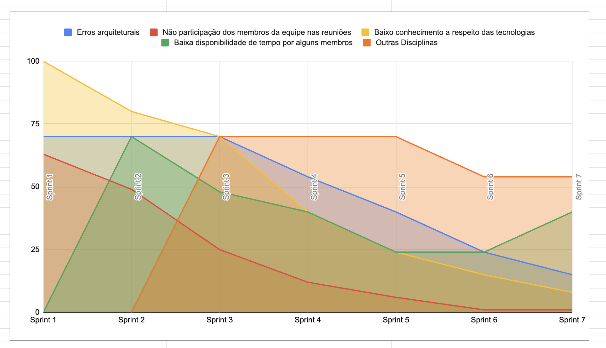
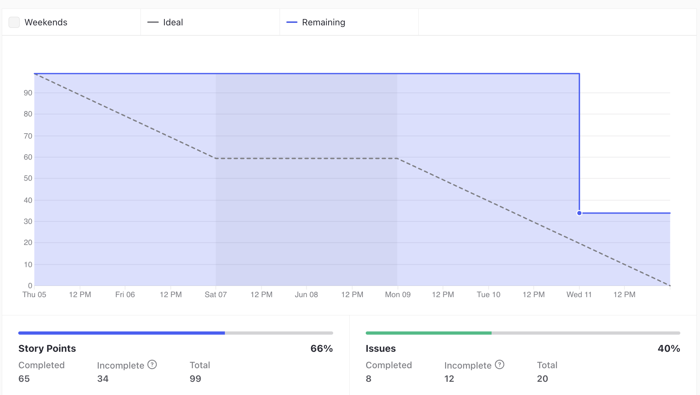
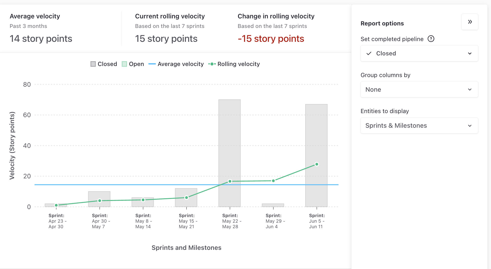
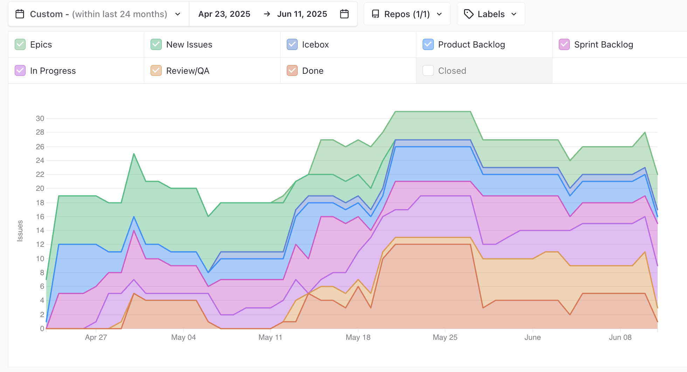
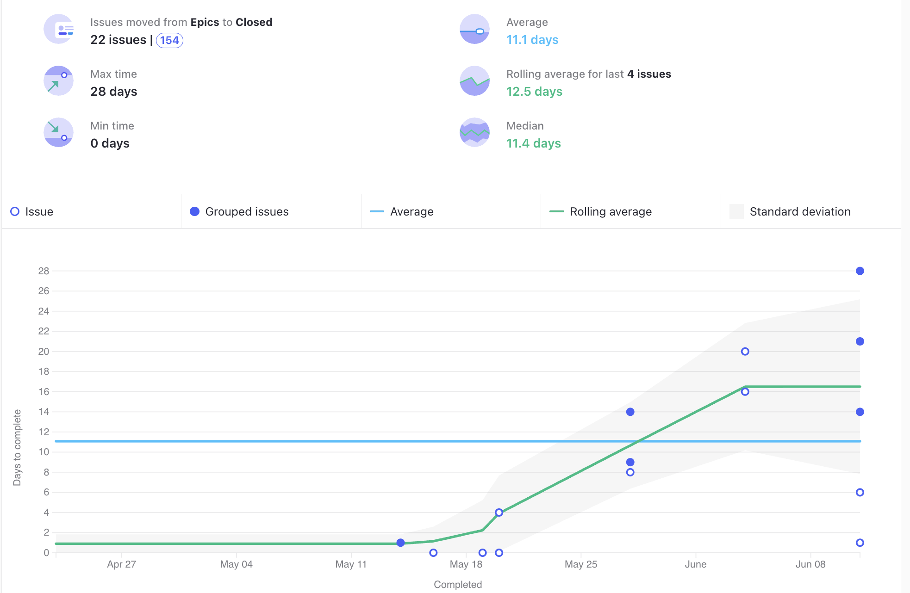

# Ata da Reunião 17

## Histórico de versões

| Versão | Alteração       | Responsável         | Data Alteração |
|--------|-----------------|---------------------|----------------|
| 1.0    | Criação da ata  | Diógenes Dantas Lélis Júnior | 10/07/2025  |

## Reunião 17 - 11/06/2025 20:00

PO - Diógenes Dantas Lélis Júnior

Scrum Master - Felipe Candito Moura

### Atividades realizas

Review da Sprint 7, realizando as seguintes atividades:

- Mostrar o que atividades realizadas.

- Alinhamento entre a equipe sobre o que foi e não foi feito.

- Discução sobre o que foi feito.

- Levantamento de melhoras e do processo do time.

### Entregas da sprint

- Adicionar receitas na tela inicial (Débito Sprint 4). Issue: [Adicionar receitas na tela inicial](https://app.zenhub.com/workspaces/2025-1time3ocr-67f593a6ef2d81000f2d84b4/issues/gh/fga-eps-mds/2025.1-sidechef-docs/42)

- Tela individual das receitas (Débito Sprint 4). Issue: [Tela individual das receitas](https://app.zenhub.com/workspaces/2025-1time3ocr-67f593a6ef2d81000f2d84b4/issues/gh/fga-eps-mds/2025.1-sidechef-docs/46)

- Padronização de código dos três repositórios (Débito Sprint 4). Issue: [Padronização de código dos três repositórios](https://app.zenhub.com/workspaces/2025-1time3ocr-67f593a6ef2d81000f2d84b4/issues/gh/fga-eps-mds/2025.1-sidechef-docs/69)

- Implementação de componentes de filtro FrontEnd (Débito Sprint 4). Issue: [Implementação de componentes de filtro FrontEnd](https://app.zenhub.com/workspaces/2025-1time3ocr-67f593a6ef2d81000f2d84b4/issues/gh/fga-eps-mds/2025.1-sidechef-docs/71)

- Criar Testes no Mobile (Débito Sprint 5). Issue: [Criar Testes no Mobile](https://app.zenhub.com/workspaces/2025-1time3ocr-67f593a6ef2d81000f2d84b4/issues/gh/fga-eps-mds/2025.1-sidechef-docs/73)

- US02 - Integração Filtro com o Front-End. Issue: [US02 - Integração Filtro com o Front-End](https://app.zenhub.com/workspaces/2025-1time3ocr-67f593a6ef2d81000f2d84b4/issues/gh/fga-eps-mds/2025.1-sidechef-docs/76)

- Resolver bug de desenvolvimento descrito no PR. Issue: [Resolver bug de desenvolvimento descrito no PR.](https://app.zenhub.com/workspaces/2025-1time3ocr-67f593a6ef2d81000f2d84b4/issues/gh/fga-eps-mds/2025.1-sidechef-docs/77)

- Diretrizes do Projeto. Issue: [Diretrizes do Projeto](https://app.zenhub.com/workspaces/2025-1time3ocr-67f593a6ef2d81000f2d84b4/issues/gh/fga-eps-mds/2025.1-sidechef-docs/79)

### Pendências da sprint

- Todas as issues definidas na planning da Sprint 6 foram entregues durante o período da Sprint, logo não deixou pendências

### Dificuldades

- Cansaço devido ao horário de início e a duração da reunião.

### Riscos

**Grafico De riscos Sprint 7**

### Burndown

**Grafico BurnDown Sprint 7**

### Velocity

**Grafico Velocity Sprint 7**

### Comulative Flow

**Grafico Cumulative Flow Sprint 7**

### Control Charts

**Grafico ControlCharts Sprint 7**

## Participantes

| Nome completo                                 | Matrícula   | Turma |
|-----------------------------------------------|-------------|-------|
| Bruno Seiji Kishibe                           | 200072854   | EPS   |
| Diógenes Dantas Lélis Júnior                  | 190105267   | EPS   |
| Felipe Candido de Moura                       | 200030469   | EPS   |
| João Marcelo Guimarães Costa Naves            | 232014709   | MDS   |
| João Pedro Silveira                           | 232014718   | MDS   |
| Davi Monteiro de Negreiros                    | 232013971   | MDS   |
| Leonardo Alves Bezerra                        | 231011604   | MDS   | 
| Vinícius de Jesus Bessa Fernandes             | 222006490   | MDS   | 
| Guilherme Negreiros Pereira                   | 232014001   | MDS   |
| Pedro Barretos Cavalcante do Amaral           | 232038433   | MDS   |
| Pietro Calegari Visentin                      | 232014754   | MDS   |
| Yasmin Dayrell Albuquerque                    | 232014226   | MDS   |
| Raissa Silva de Oliveira                      | 232014763   | MDS   |

## Não participaram

| Nome completo                                 | Justificativa                                        | Turma |
|-----------------------------------------------|------------------------------------------------------|-------|

